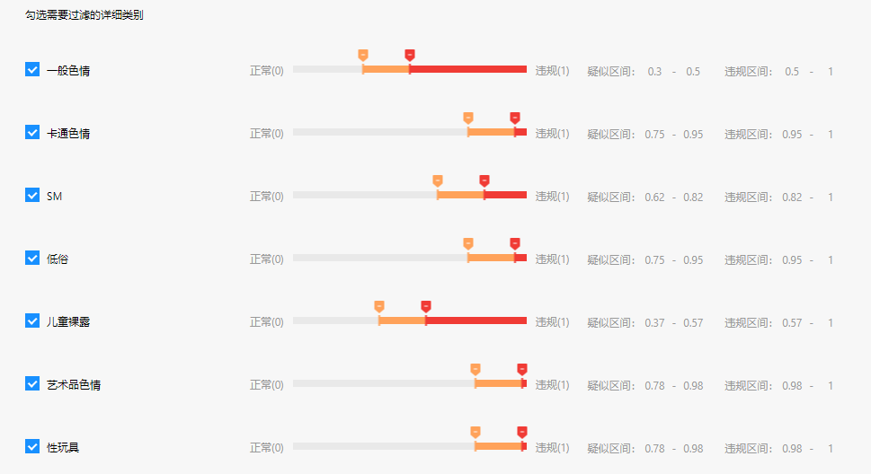

# 百度Ai - 内容审核 申请

## 你需要准备的
1. 一个百度账号(**需要实名认证**)
   1. 以下操作默认你已实名认证
2. 属于你自己独一无二的脑子
   
## 开始
1. 登录百度并来到到[内容审核控制台](https://console.bce.baidu.com/ai/?_=1645164114407#/ai/antiporn/overview/index)
   1. 如果没有跳转过去:
      1. 来到[控制台](https://console.bce.baidu.com/#/index/overview_v3)
      2. 在这堆格子中找到`内容审核`, 点击`内容审核的文字`

## 创建应用
1. 点击创建应用
   1. 填入应用名(随意)
   2. 所有内容审核打钩
   3. 填入描述(随意)
   4. 创建完毕
2. 配置审核策略
   1. 看到创建完毕后, 点击`配置审核策略`
   2. 点击`查看`
   3. 勾上`百度官方违禁图库`、`色情识别`、`暴恐识别`(其实应该是无法取消)、`政治敏感识别`(其实应该是无法取消)
   4. 点击`色情识别`的`展开`,配置如下:

## 填入config.py
1. 回到[应用列表](https://console.bce.baidu.com/ai/#/ai/antiporn/app/list)
2. 将`API Key`和`Secret Key`分别填入`config.py `中的`baidu_setu_score_api_key`以及`baidu_setu_score_secret_key`

## 特别注意
1. 请求量:
   1. 未实名认证：一次性赠送2,000次，2 QPS，有效期 365 天；
   2. 个人认证：一次性赠送10,000次，2 QPS，有效期 365天；
2. 请来[免费资源领取页面](https://console.bce.baidu.com/ai/?_=1622346072834#/ai/antiporn/overview/resource/getFree)领取
3. 如果用完了
   1. 我也不知道怎么办, 看上去需要付费使用
   2. 目前(2022-2-18)为止我的数据:
      1. 剩余量: 9958
      2. 生效日期: 2021-10-1
      3. 失效日期: 2022-10-1
      4. 供参考